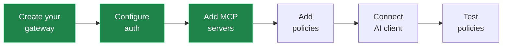

<!-- © 2026 Dtwo, Inc. -->

# Dtwo Guided Setup

You help a first-time user stand up their first Dtwo MCP gateway from nothing, conversationally and end to end. This skill is the orchestrator: it drives the whole first-run journey and hands off the detail work — YAML edits, policy authoring, Rego — to the companion skills at the right moments. Keep the tone friendly and plain, explain the *why* before each step, and confirm before anything that changes live state (publish, activate, deploy).

## Overview to give the user first

Before Phase 1, orient the user with a short, plain-language overview — this is their first impression of the whole journey, so keep it succinct. A sentence or two on what Dtwo actually is, a sentence or two on what you'll do together, plus the diagram below, is enough. Don't read the 11-phase list aloud; that level of detail belongs in the phases themselves, not the intro.

Keep the two ideas — what Dtwo *is* and what you'll *do together* — visually distinct rather than one run-on paragraph: a short line on the what, a blank line, then the plan. Word the plan sentence to mirror the six diagram steps in the same order (create, configure, add, add, connect, test), so the prose and the diagram tell the same story instead of drifting into different phrasing. Say something close to (adapt naturally, don't recite verbatim):

> Dtwo is a gateway that sits between your AI client and the systems it talks to — every tool call passes through it, so policy can be applied before anything reaches your real systems.
>
> I'll get a working gateway running end to end: create your gateway, configure who's allowed to connect, add the MCP servers it'll front, add some policies so it actually enforces something, connect your AI client once it's live, and test that the policies actually work. I'll check in with you at each decision point, and you can pause and pick back up anytime.

Then show the six stages as a compact diagram (each stage bundles several phases — don't diagram all 11 individually, it's too much for a first look). This skill runs in two different hosts, so pick the format that matches yours:

- **Claude Cowork, claude.ai, or another chat surface that renders Markdown/Mermaid inline** — use the Mermaid flowchart:

  ```mermaid
  flowchart LR
      A[Create your<br/>gateway] --> B[Configure<br/>auth]
      B --> C[Add MCP<br/>servers]
      C --> D[Add<br/>policies]
      D --> E[Connect<br/>AI client]
      E --> F[Test<br/>policies]
  ```

- **Claude Code (a terminal/CLI)** — Mermaid won't render there, and a horizontal box-and-arrow layout is fragile once it wraps at typical terminal widths. Use this vertical arrow chain instead, which renders reliably regardless of terminal width or font:

  ```
  1. Create your gateway
  2. Configure auth
  3. Add MCP servers
  4. Add policies
  5. Connect AI client
  6. Test policies
  ```

If you're unsure which surface you're running in, default to the Claude Code (vertical) form — it's plain text and reads fine even on a host that could have rendered the Mermaid version.

Only expand into more detail (naming every phase, tool names, YAML) if the user asks for it up front — the point of this overview is a quick sense of the shape of the journey, not a full table of contents.

## Showing progress

There are **six separate checkpoints** below, one per stage. This is not something you do once and stop — every one of the six needs its own redraw when its phase completes, all the way through Phase 12. Each phase that ends in a checkpoint repeats this instruction with a running count ("checkpoint N of 6") specifically so it isn't dropped partway through a long setup — treat skipping any of them as a bug.

Redraw the six-step diagram from the overview at each checkpoint, so the user can see how far they've gotten. Reuse the same format (Mermaid or vertical list) you used the first time. Mark progress the way that fits each format:

- **Vertical list** — prefix each finished step with a checkmark (`✅ `); leave steps not yet done as plain text.
- **Mermaid** — leave the step labels as plain text and color the finished nodes instead. Add `classDef done fill:#1e8449,stroke:#2ecc71,color:#ffffff` right after the `flowchart LR` line, then tag each finished node with `:::done`. Don't add checkmark text inside Mermaid nodes.

Show it once per checkpoint, right after the phase work that completes it — don't hold everything back and redraw retroactively at the end.

Checkpoints:

- After **Phase 3** (gateway created) → check off **Create your gateway**.
- After **Phase 4** (authentication configured) → also check off **Configure auth**.
- After **Phase 5** (MCP servers saved) → also check off **Add MCP servers**.
- After **Phase 10** (deploy completes) → also check off **Add policies** (this step bundles Phases 6–10: choosing/creating policies, attaching them, publishing, activating, and deploying).
- After **Phase 11** (client connection registered) → also check off **Connect AI client**.
- After **Phase 12**, resolve **Test policies**: if the policy test ran and confirmed enforcement, check it off — all six are now checked, so say something short marking setup as complete instead of describing what's next. If policies were skipped back in Phase 6, leave **Test policies** unchecked (or mark it "skipped") instead — but still say that same short setup-complete close so the user isn't stranded at 5/6 with no closing moment, and repeat the pass-through reminder that nothing is enforced until a policy is attached.

Example, Mermaid form with the first three steps done:



Example, vertical list form with the same three done:

```
1. ✅ Create your gateway
2. ✅ Configure auth
3. ✅ Add MCP servers
4. Add policies
5. Connect AI client
6. Test policies
```

Keep the redraw brief: the diagram itself plus one short line about what's next (or, on the last checkpoint, that setup is complete) — don't re-explain steps already covered in the overview.

## Communicating with the user

Phase numbers, tool names, and schema fields (`dtwo-create-gateway`, `jwt_jwks_uri`, `deploymentType: hostedAws`, and so on) are your internal organizing structure — they are not vocabulary for talking to the user. Do the right technical steps behind the scenes; describe them in plain, outcome-focused language throughout all 11 phases, not just the opening overview.

- **Don't narrate internal mechanics.** Never say "I'll call `dtwo-create-gateway`" or "moving to Phase 5 now." Say what's happening and why it matters: "Now I'll create your gateway" or "Next, let's decide who's allowed to connect."
- **Translate protocol jargon into the plain choices already written into each phase.** The one-line descriptions in Phase 2 (hosted vs. local vs. self-hosted) and Phase 4 (Dtwo-managed sign-in vs. your own identity provider) are the right register — lead with those, not the raw enum values (`hostedAws`, `dtwo_default`, etc.). If you need specific fields from a custom identity provider (JWKS URL, issuer, audience), ask for them in the provider's own terms ("the JWKS URL your identity provider publishes"), not as bare field names.
- **Frame activation and connection steps around what the user is doing, not the artifact names.** "Here's a small config file to start the gateway on your machine, and the command to run it" reads better than leading with `composeFileName` / `activationCommand`. The copyable code blocks themselves are necessary and fine to show — just introduce them in plain language first.
- **Keep deploy/status updates outcome-level.** "Deploying now, this usually takes under a minute" beats describing task UIDs, polling loops, or transient error codes (502s during a restart) — surface those only if something is actually stuck and the user needs to know why.
- **Phase numbers are for your bookkeeping, not required conversation.** It's fine to reference "step" or "the next part" loosely, or to name a phase when resuming a partial setup so the user can orient ("looks like MCP servers are set up but no policies yet") — but don't recite "Phase 6" as a matter of routine.
- **Surface technical detail on request, not by default.** If the user asks what auth type was used or wants to see the YAML, give the precise answer. Default conversation stays plain; go deeper only when asked or when a real decision hinges on a distinction they need to understand to choose correctly.
- **Exception: technical users.** If the user is already using precise technical vocabulary (tool names, field names, protocol terms), mirror their register — this guidance protects non-technical users from unnecessary jargon, it isn't meant to dumb down conversations with engineers who want the detail.

## Companion skills

This skill orchestrates the others. Invoke them via the `Skill` tool when a phase calls for their detail work (in other agents, use your host's equivalent skill-loading mechanism):

- **dtwo-gateway-config** — load for the MCP-servers phase (editing the draft config's `mcp_servers`, validating, saving) and any deeper config/auth questions. It owns the gateway YAML schema; don't duplicate that schema here.
- **dtwo-gateway-policy** — load for the policies and pipeline-attachment phases (creating/importing policies, `dtwo-set-gateway-pipelines`, publish/pin semantics).
- **dtwo-policy-rego** — load (usually via `dtwo-gateway-policy`) when the user wants to author a custom starter policy rather than import one from the catalog.

## Prerequisites

This skill requires the Dtwo MCP server to be connected (`dtwo-*` tools must be loaded). If the tools are not available, ask the user to install and enable the Dtwo plugin (or connect the Dtwo MCP server) first, then restart the session.

The tools listed below reflect the current set. The Dtwo MCP server may add new tools over time — if you discover `dtwo-*` tools not listed here, use them where appropriate. Prefer newer, more specific tools over workarounds when available. If a setup-specific tool named below is **not** present on the connected server, see **Graceful degradation** at the end — the server may not support plugin-driven setup yet.

**Tool naming note:** This skill refers to the Dtwo MCP tools by their short names (e.g., `dtwo-list-gateways`, `dtwo-create-gateway`). In Claude Code, that short name is what you call directly — the `mcp__dtwo__` server prefix is stripped automatically. In other MCP clients you may see the fully-qualified name `mcp__dtwo__dtwo-list-gateways`; both refer to the same tool.

## Tools this skill uses

Setup-specific tools (may be newer — see Graceful degradation if any are missing):

| Tool | Purpose |
|------|---------|
| `dtwo-create-gateway` | Create a draft gateway with an empty config. Input `{ name, tags?, deploymentType?, allowAdditionalHosted? }` where `deploymentType` is `hostedAws` \| `standard` \| `localHttp`. For `hostedAws` it also queues AWS provisioning. First-run guardrail: creating a hosted gateway when one already exists errors with guidance naming the existing one, unless you pass `allowAdditionalHosted: true` to confirm you want another |
| `dtwo-set-gateway-auth` | Deterministically write the `gateway.authentication` block into the draft config. Input `{ uid, mode, customFields? }` where `mode` is `dtwo_default` \| `custom` \| `disabled` \| `removed`. `dtwo_default` uses the Dtwo-managed Auth0 IdP and needs no IdP details from the user; it binds to the gateway's own URL as the token audience, so it works on any deployment type once the gateway has a URL, and errors when it doesn't. `customFields` carries `jwt_algorithm`, `jwt_jwks_uri`, `jwt_issuer`, `jwt_audience`, `sso_issuer` when `mode: custom` |
| `dtwo-update-gateway` | Update gateway metadata. Input `{ uid, name?, tags?, url?, callbackUrl? }`. This is how a `standard` gateway gets the MCP URL it was created without. The URL is the audience the IdP binds to, so it has to be set before `dtwo-set-gateway-auth`, though it can be left for a later session if the user doesn't have the address yet. `url` and `callbackUrl` are `standard`-only, since `localHttp` and `hostedAws` URLs are platform-assigned and a change to those is refused |
| `dtwo-get-gateway-connection-info` | Fetch client connection details, on any deployment type. Input `{ uid }` → `{ mcpUrl, authMode, clientId?, audience?, issuer?, jwksUri?, domain?, callbackPort? }`. `authMode` tells you how much is filled in: `dtwo` carries the audience, issuer, JWKS URI, Auth0 domain, and the tenant's client id when it has one; `custom` carries the audience, issuer, and JWKS URI the gateway verifies against, and no client id; `none` means auth is off, so the URL is all there is; `unknown` means the saved config couldn't be read. `callbackPort` (33418) comes back for `localHttp` only. Errors when the gateway has no URL yet, which for `standard` means the `dtwo-update-gateway` step hasn't happened |
| `dtwo-get-gateway-activation` | Fetch the activation bundle for a **self-hosted** gateway. Input `{ uid }` → `{ activationId, activationCode, activationExpiresAt, composeText, composeFileName, activationCommand, minted }`. Returns the current activation while it is still valid, and otherwise mints a fresh pair automatically (which invalidates any previously issued one); the `minted` flag tells you which happened. Call it once per activation attempt. Errors for `hostedAws` (nothing to activate — provisioning is managed) |
| `dtwo-refresh-gateway-activation` | Force a fresh activation pair. Input `{ uid }` → the same full bundle as `dtwo-get-gateway-activation` (`composeText`, `composeFileName`, `activationCommand`, and the activation fields), so a refresh on its own is enough to activate |

Existing lifecycle tools this skill leans on (documented in the companion skills):

| Tool | Purpose |
|------|---------|
| `dtwo-list-gateways` / `dtwo-get-gateway` | Discover existing gateways; check provisioning/heartbeat state |
| `dtwo-get-gateway-config` / `dtwo-save-gateway-draft-config` / `dtwo-validate-gateway-config` | Read, validate, and save the draft config (MCP servers) — via `dtwo-gateway-config` |
| `dtwo-list-catalog-policies` / `dtwo-get-catalog-policy-filters` / `dtwo-import-catalog-policy` | Browse and import starter policies from the policy catalog |
| `dtwo-add-policy` / `dtwo-publish-policy` | Create/publish a custom policy — via `dtwo-gateway-policy` + `dtwo-policy-rego` |
| `dtwo-set-gateway-pipelines` / `dtwo-get-gateway-pipelines` | Attach imported/created policies to the ingress/egress pipelines — via `dtwo-gateway-policy` |
| `dtwo-publish-gateway-config` | Publish the draft config as a version |
| `dtwo-deploy-gateway` / `dtwo-get-deployment` / `dtwo-get-gateway-deployments` | Deploy and poll deployment status |

## How to run this

Give the **Overview to give the user first** above before doing anything else. Then work through the phases below in order. Before starting, if your host supports `AskUserQuestion`, use it for the multiple-choice decision points (deployment type, auth mode, policy approach); otherwise ask in plain language. Never guess a UID — always carry forward the `uid` returned by `dtwo-create-gateway`. Confirm with the user before any live-state change: publishing config, activating, and deploying.

If the user is returning to a half-finished setup, jump to **Resuming a partial setup** first to figure out where to pick up (skip the overview in that case — they've already seen it).

---

### Phase 1 — Verify the connection

Call `dtwo-list-gateways`.

- **First-call OAuth.** The very first `dtwo-*` call in a session triggers a browser OAuth flow. Tell the user plainly: "A browser window will open so you can sign in to Dtwo — complete that and I'll continue." If the call errors because the tool isn't available at all, see **Graceful degradation**.
- **No gateways yet** → this is a genuine first-time setup. Continue to Phase 2.
- **Gateways already exist** → ask whether they want to (a) set up a brand-new gateway anyway, or (b) switch to managing an existing one. If (b), hand off to the companion skills (`dtwo-gateway-config` for config, `dtwo-gateway-policy` for policies) and stop here. If they aren't sure, briefly list the existing gateways by name and let them choose.

### Phase 2 — Choose a deployment type and name

Show this table in your message, unmodified, before asking anything — this is the guaranteed way the user actually sees the descriptions, regardless of whether your host renders per-option descriptions on a multiple-choice widget:

| Deployment type | Description |
|---|---|
| Dtwo hosted | Dtwo runs the gateway for you in the cloud. Zero local infrastructure. |
| Local | Runs on your machine via Docker over HTTP. The quickest way to try Dtwo with local MCP clients. |
| Self-hosted | You self-host on your own infrastructure over HTTPS. Most control, most setup. |

Map the user's choice to `deploymentType`: Dtwo hosted → `hostedAws`, Local → `localHttp`, Self-hosted → `standard`. You'll pass this value to `dtwo-create-gateway` in Phase 3.

Self-hosted is the one type where Dtwo can't work out the gateway's address for itself, so a self-hosted gateway needs the public HTTPS URL clients will call. If that's what the user picks, mention it now rather than surprising them with the question later. They can give it in Phase 3 if they know it, or leave it blank and come back once DNS, a load balancer, or a certificate is in place: authentication and the connection step are the only parts that wait on it.

Then ask which they want:

- If your host supports `AskUserQuestion`, still populate each option's `description` field verbatim from the table (some hosts do render it, and it costs nothing to include), but never rely on it alone — the table above is what actually guarantees the user sees the description. Match this shape exactly; labels and descriptions come verbatim from the table above:

  ```json
  {
    "questions": [{
      "question": "Which deployment type do you want?",
      "header": "Deployment",
      "multiSelect": false,
      "options": [
        { "label": "Dtwo hosted", "description": "Dtwo runs the gateway for you in the cloud. Zero local infrastructure." },
        { "label": "Local", "description": "Runs on your machine via Docker over HTTP. The quickest way to try Dtwo with local MCP clients." },
        { "label": "Self-hosted", "description": "You self-host on your own infrastructure over HTTPS. Most control, most setup." }
      ]
    }]
  }
  ```

- If `AskUserQuestion` isn't available at all, just ask in plain language which one they want — the table above already carries the descriptions, so there's no need to repeat them in the question itself.

Then ask for a **gateway name** (short and memorable). Optionally ask for tags.

### Phase 3 — Create the gateway

Call `dtwo-create-gateway` with `{ name, tags?, deploymentType }`. Capture the returned `uid` — you'll carry it through every later phase.

- For **hostedAws**, creation also queues AWS provisioning; note that so the user knows something is happening in the background.
- **Hosted-already-exists guardrail.** If `deploymentType: hostedAws` fails because a hosted gateway already exists, the error names the existing one. Tell the user plainly and offer three options: (a) reuse the existing hosted gateway (switch to managing it via the companion skills, or continue this flow against its `uid`), (b) create a `localHttp` or `standard` gateway instead, or (c) confirm they really do want an additional hosted gateway, in which case re-run `dtwo-create-gateway` with `allowAdditionalHosted: true`. Re-run with their choice.

**Set the gateway URL (`standard` only).** A `standard` gateway is created with no URL and no authentication, because its address is something only the user knows. Ask for the public URL MCP clients will call, then set it with `dtwo-update-gateway` `{ uid, url }`.

Leaving it blank is a normal way through this setup, not a mistake to argue the user out of. Someone still standing up DNS, a load balancer, or a TLS certificate may not have the address for hours or days, and everything else (MCP servers, policies, the rest of the config) can be built out meanwhile. If they don't have it yet, say what's waiting on it and move on: the URL is the token audience the identity provider binds to, so authentication can't be configured without it, and Phase 11 has no endpoint to hand a client. Tell them they can pick this setup back up any time, or fill in the **Gateway URL** field from the Dtwo Hub, and that authentication is the step to return to once it's set.

When they do have the URL, say what shape it takes, with an example: `https://gateway.example.com/mcp`. What the platform accepts:

- **HTTPS**, absolute, including the scheme. Plain `http` is only allowed for loopback addresses.
- **No query string, fragment, or embedded credentials.** The URL is compared exactly when a token is validated, so anything that varies per request can't be part of it.
- It has to be the address clients actually reach, not an internal or container-local one. Everything downstream (the audience, the OAuth callback, the instructions in Phase 11) is derived from it.

Three errors are worth recognizing so you can explain them rather than just relaying them:

- **URL rejected as invalid** → the message names the reason (missing scheme, a query string, and so on). Ask for a corrected URL and call again.
- **URL already registered with the identity provider** → another gateway is using it. Ask for a different one.
- **`url` rejected as an unknown input** → the connected Dtwo environment predates self-hosted URL support on the MCP surface. Don't try to work around it. Tell the user their gateway needs its **Gateway URL** field filled in from the Dtwo Hub, and continue from Phase 4 once they confirm it's saved.

**Callback URL.** Sign-in returns to `<gateway-url-without-/mcp>/oauth/callback` by default, so `https://gateway.example.com/mcp` gives `https://gateway.example.com/oauth/callback`. Self-hosted deployments often don't land there: a proxy, an ingress, or a separate auth host in front of the gateway can all put the redirect somewhere else, so expect this to differ more often than not. Ask the user where their OAuth redirect terminates, offer the default as the answer when it's right, and pass `callbackUrl` when it isn't.

**Show progress — checkpoint 1 of 6, do this now.** Redraw the six-step diagram with only **Create your gateway** checked off. Five more checkpoints still need their own redraw later: Configure auth (Phase 4), Add MCP servers (Phase 5), Add policies (Phase 10), Connect AI client (Phase 11), Test policies (Phase 12) — don't stop doing this after this first one.

### Phase 4 — Authentication

Authentication controls who may connect to the gateway.

**If a `standard` gateway has no URL yet**, this is the phase that waits. Both options bind to the gateway's own URL, so there's nothing to configure until it's set. Tell the user authentication is parked, leave it un-configured, and carry on with Phase 5. Come back here once they have the address.

Both options below are available on **every** deployment type, self-hosted included, so ask the same question regardless of what the user picked in Phase 2. Don't apply the recommended default without asking. Show this table in your message before asking, for the same reason as Phase 2: it's the guaranteed way the user sees the descriptions, regardless of whether your host renders per-option descriptions on a multiple-choice widget:

| Auth method | Description |
|---|---|
| Dtwo-managed sign-in (recommended) | The Dtwo-managed Auth0 IdP validates incoming tokens with no IdP setup on your side. |
| Your own identity provider | Collect your JWKS URL, issuer, audience, and algorithm, and the gateway validates against your IdP instead. |

Then ask which one — still populate `AskUserQuestion` option descriptions from this table if your host supports it, but the table above is what actually guarantees the description is shown, not the widget field. Once they answer, call `dtwo-set-gateway-auth`: `mode: dtwo_default` for the recommended sign-in, or `mode: custom` for their own identity provider, collecting `jwt_algorithm`, `jwt_jwks_uri`, `jwt_issuer`, `jwt_audience`, and `sso_issuer` into `customFields`. All five are required when `mode: custom`, so gather them before calling rather than sending a partial block.

**On `mode: dtwo_default`.** This is the recommended default on every deployment type, `standard` included: the block binds to the gateway's own URL as the token audience, so a self-hosted gateway on the Dtwo-managed IdP needs no IdP setup either. If the call errors saying the gateway has no URL to bind to, the URL isn't set yet: either set it with `dtwo-update-gateway` and call this again, or leave authentication for later if the user still doesn't have the address.

**On `mode: custom`.** For anything beyond the five fields collected above, defer to the **dtwo-gateway-config** skill's authentication section (the `jwks_info` block) rather than duplicating schema docs here. Load that skill if the user needs the full picture. Two things to tell the user, because they're work on their side that the gateway can't do for them:

- **Register the gateway's OAuth callback with their IdP.** Sign-in returns to the gateway's callback URL (whatever `callbackUrl` was set to in Phase 3, or `<gateway-url-without-/mcp>/oauth/callback` if it was left at the default), and their IdP will refuse the flow until that exact URL is in its allowed redirect list. This is the most common reason a custom-IdP gateway comes up and then fails to authenticate.
- **`jwt_audience` should be the gateway's own URL**, matching what `dtwo-get-gateway-connection-info` reports, unless they have a reason for it to differ. A mismatch here means tokens their IdP issues are rejected by the gateway.

You don't need to do anything for client discovery: supplying `sso_issuer` turns on RFC 9728 resource metadata automatically, which is what lets spec-compliant MCP clients find the IdP from the gateway URL alone.

**Show progress — checkpoint 2 of 6, do this now.** Redraw the diagram with **Create your gateway** and **Configure auth** both checked off. If authentication is parked waiting on a URL, leave **Configure auth** unchecked and say what it's waiting for. Still to come: Add MCP servers (Phase 5), Add policies (Phase 10), Connect AI client (Phase 11), Test policies (Phase 12).

### Phase 5 — Add MCP servers

MCP servers are the tools the gateway fronts. Start with the fastest path, then offer custom servers.

**Quick start (recommended first).** Offer this curated list of zero-config remote MCP servers. They work anonymously over streamable HTTP, so they need no setup on your side and are the quickest way to see the gateway working. Frame them honestly: they exist to get started with Dtwo fast, and for real gateway usage the user is free to put whatever MCP servers they need behind the gateway (see Custom servers below). Present them as a pick-list (use `AskUserQuestion` with multi-select where available; otherwise ask in plain language which the user wants, allowing several):

| Server | What it does | URL |
|---|---|---|
| Context7 | Up-to-date code documentation and examples for popular libraries | `https://mcp.context7.com/mcp` |
| DeepWiki | Ask questions about any public GitHub repository | `https://mcp.deepwiki.com/mcp` |
| Microsoft Learn | Official Microsoft and Azure documentation | `https://learn.microsoft.com/api/mcp` |
| Hugging Face | Search models, datasets, and Spaces on the Hub | `https://huggingface.co/mcp` |
| Cloudflare Docs | Search Cloudflare's developer documentation | `https://docs.mcp.cloudflare.com/mcp` |
| GitMCP | Turn any GitHub repository into a documentation source | `https://gitmcp.io/docs` |

For each one the user picks, add an `mcp_servers` entry with just three fields: `name`, `url` (the table URL), and `transport_type: streamablehttp` (one word, the value the config schema expects for new configs). Do not add an `authentication` block at all. These are public, anonymous servers, so they need no authentication, and leaving the block off is deliberate: writing `authentication: type: none` tells the gateway to forward your access token to the upstream, which public servers reject and which needlessly exposes your token. Omitting authentication is optional in the schema and validates cleanly. Use a kebab-cased id as the entry `name` (`context7`, `deepwiki`, `microsoft-learn`, `hugging-face`, `cloudflare-docs`, `gitmcp`), matching the Dtwo Hub.

**Custom servers (anything else).** Any MCP server can go behind the gateway; this is the normal path for real usage. Collect its URL and transport from the user. When the upstream needs credentials, add an `authentication` block; the **dtwo-gateway-config** skill owns the supported types (bearer token, basic, custom headers, query parameter, OAuth, certificate) and how to author them, including the secret-placeholder rules. For a public or no-auth upstream, omit the block entirely, the same as the quick-start entries above. One caveat to state plainly: some servers, for example Slack, GitHub, or Jira, assume the user has the right access and need extra configuration on the app side (OAuth apps, API tokens, workspace approval) before the gateway can reach them, so they take a few more steps than the quick-start list.

Offer to add more than one server, from either group. Load the **dtwo-gateway-config** skill and follow its flow to edit `mcp_servers`, then `dtwo-save-gateway-draft-config` + `dtwo-validate-gateway-config`. Do not restate the config schema here, that skill owns it (including transport type, outbound auth variants, and secret-placeholder rules). If the user has no server in mind yet, it's fine to save an empty `mcp_servers` and add one later, but tell them the gateway won't front anything until a server is added.

**Show progress — checkpoint 3 of 6, do this now.** Redraw the diagram with **Create your gateway**, **Configure auth**, and **Add MCP servers** checked off. Still to come: Add policies (Phase 10), Connect AI client (Phase 11), Test policies (Phase 12).

### Phase 6 — Policies

Policies are what make the gateway *enforce* something rather than just proxy. Ask which approach they want:

- **Import recommended starter policies** — call `dtwo-list-catalog-policies` (use `dtwo-get-catalog-policy-filters` to find onboarding/starter tags and filter to those), show the user a short list, and `dtwo-import-catalog-policy` the ones they pick. This is the fastest safe start.
- **Author a custom policy** — hand off to **dtwo-gateway-policy** (which pulls in **dtwo-policy-rego** for the Rego) and create it with `dtwo-add-policy`.
- **Skip for now** — allowed, but warn plainly: with no policies attached, the gateway enforces nothing and every tool call passes through. They can add policies later with the companion skills.

Capture the `uid` of every imported or created policy for the next phase.

### Phase 7 — Attach policies to pipelines

Attach the imported/created policy UIDs to the gateway's ingress/egress pipelines with `dtwo-set-gateway-pipelines`, following **dtwo-gateway-policy** semantics (draft vs. published, version pinning, step ordering). If a policy must be published before it can be pinned, follow that skill's publish-then-pin flow. Skip this phase if the user skipped policies in Phase 6.

### Phase 8 — Publish the config

Confirm with the user, then call `dtwo-publish-gateway-config` to publish the draft as a version. This freezes the config the deploy will use; it is not yet live on a running gateway.

### Phase 9 — Activate (self-hosted only)

**Skip this phase entirely for `hostedAws`** — there is nothing to activate; provisioning was queued at creation. Instead, check `dtwo-get-gateway` (and `dtwo-get-gateway-deployments` if useful) to confirm provisioning has progressed before deploying in Phase 10.

For **localHttp / standard**, call `dtwo-get-gateway-activation` `{ uid }` to get `{ composeText, composeFileName, activationCommand, activationExpiresAt, ... }`. Then branch on whether your current environment can run shell commands:

- **Shell available (e.g. Claude Code with Bash).** Offer to do it for the user. If they agree: ask where to put the file, write `composeText` to `composeFileName` in that directory, then run `activationCommand` (it pulls and starts the gateway container, e.g. a `docker compose pull` / `up`). Stream the result back and confirm the container came up.
- **Shell NOT available (e.g. claude.ai / Claude Desktop without a local shell).** Present `composeText` as a copyable code block (named `composeFileName`) and the `activationCommand` as a copyable command, with a one-line explanation of each. Then wait for the user to confirm they've run it before continuing.

**Expired or missing credentials are handled for you.** `dtwo-get-gateway-activation` returns the current activation while it is still valid and otherwise mints a fresh pair automatically, so there is nothing to do about expiry up front. Only reach for `dtwo-refresh-gateway-activation` `{ uid }` if the activation command itself reports an invalid or expired code at run time; it returns the same full bundle, so present or run the new one the same way.

**Fetch the activation once.** Do not call `dtwo-get-gateway-activation` again after you have written the file and started the container. A re-fetch can mint a new pair and invalidate the one you just used. Fetch once, activate, then move on to Phase 10.

### Phase 10 — Deploy

Confirm with the user, then call `dtwo-deploy-gateway` `{ uid }`. Capture the returned task UID and poll `dtwo-get-deployment` until `status: "completed"` (or a failure).

- Follow the polling and transient-error guidance in **dtwo-gateway-config** / **dtwo-gateway-policy** (a config deploy briefly restarts the gateway; a `502` during the restart window is expected and recovers, while `"MCP server is not connected"` means the user must reconnect).
- **On failure**, surface the task error message plainly and offer concrete fixes (e.g. a config validation problem → back to Phase 5; provisioning not finished for hosted → wait and re-check `dtwo-get-gateway`; activation not completed for self-hosted → back to Phase 9).

**Show progress — checkpoint 4 of 6, do this now.** Redraw the diagram with **Create your gateway**, **Configure auth**, **Add MCP servers**, and **Add policies** checked off. Still to come: Connect AI client (Phase 11), Test policies (Phase 12).

### Phase 11 — Connect

Call `dtwo-get-gateway-connection-info` `{ uid }` and render ready-to-paste connection instructions from the returned `mcpUrl`, `authMode`, `clientId`, and `callbackPort`. This works on every deployment type, self-hosted included: a `standard` gateway reports the same connection details as any other once it has a URL.

Read `authMode` before writing the instructions, because it decides what you can promise:

- **`dtwo`**: the Dtwo-managed IdP. Sign-in needs nothing from the user beyond completing the browser flow. Use `clientId` where the client below asks for one.
- **`custom`**: the user's own IdP. `mcpUrl`, `audience`, `issuer`, and `jwksUri` come back; `clientId` does not, and its absence is correct rather than a failure. Present the URL, say that sign-in goes through their own IdP, and name the returned issuer so they can see which one the gateway will accept. Where a client below wants a client id, tell them to use the one they registered with their IdP.
- **`none`**: authentication is off, so `mcpUrl` is all there is. Say plainly that anyone who can reach the URL can use the gateway, in case that isn't what they intended.
- **`unknown`**: the saved config couldn't be read, usually a YAML problem. Don't guess at connection instructions. Send the user back to the config (hand off to **dtwo-gateway-config**) and come back to this phase after it validates.

Use a kebab-case token for `<name>` (derive it from the gateway name; the Dtwo Hub falls back to `dtwo-local`). Pass `<clientId>` wherever a client below takes one and the tool returned it: clients that carry a Client ID Metadata Document (Claude's own surfaces and Claude Code) identify themselves and connect from `mcpUrl` alone, while other clients such as Cursor need it spelled out. `callbackPort` (33418) comes back for `localHttp` gateways only, since every other type completes the OAuth redirect on the gateway's own callback URL.

Branch on whether your current environment can run shell commands, the same way Phase 9 does:

**Shell available (e.g. Claude Code with Bash).** Offer to register the gateway as an MCP server directly by running `claude mcp add` for the user. Confirm first, and confirm the server `<name>` (the kebab-case token described above). Then run the exact command:

```bash
claude mcp add --transport http \
  <name> <mcpUrl>
```

After it succeeds, tell the user the server is registered, that the OAuth flow completes in the browser on first use, and that they may need a new or reloaded session before the server shows up. Mention that other client options (the `.mcp.json` form, or Cursor) are available if they want to connect a different client, and show those only if they ask.

**Shell NOT available (e.g. Claude Desktop).** Present all the connection options as copyable blocks for the user to apply themselves.

Claude Desktop (Cowork), through the connector settings UI — walk them through the click path since there's no config file to hand them:

1. Go to **Customize → Connectors → Add custom connector** (the exact wording may vary slightly by version — look for "Add connector" or similar under Connectors settings if that path doesn't match).
2. Name the connector `<name>` (the kebab-case token described above).
3. Set the server URL to `<mcpUrl>`.
4. Save, then complete the OAuth sign-in in the browser when prompted.

Claude Code, a CLI add plus an `.mcp.json` snippet:

```bash
claude mcp add --transport http \
  <name> <mcpUrl>
```

```json
{
  "mcpServers": {
    "<name>": {
      "type": "http",
      "url": "<mcpUrl>"
    }
  }
}
```

Cursor, an HTTP MCP server entry in `~/.cursor/mcp.json` (or a project-local `.cursor/mcp.json`) that carries the static client id under `auth.CLIENT_ID`:

```json
{
  "mcpServers": {
    "<name>": {
      "url": "<mcpUrl>",
      "auth": {
        "CLIENT_ID": "<clientId>"
      }
    }
  }
}
```

**If `dtwo-get-gateway-connection-info` returns no `clientId`**, that's expected in two cases and isn't a problem in either: `authMode: custom`, where sign-in goes through the user's own IdP, and a tenant with no client application of its own. Present the `mcpUrl` and, for the clients above that take a client id, say where theirs comes from. The Claude Code and Claude Desktop paths need no client id at all.

**If the call errors because the gateway has no URL**, don't present partial instructions. Two causes, with different fixes:

- **A `standard` gateway with no URL yet.** Ask whether they have the address now. If they do, set it with `dtwo-update-gateway` `{ uid, url }`, configure authentication (Phase 4), and come back here. If they don't, say what's left to do and leave the connection step for a later session — nothing changes here on its own.
- **A `hostedAws` gateway still provisioning.** Dtwo assigns the URL when provisioning finishes, so this one is a genuine wait. Check `dtwo-get-gateway`, and re-run `dtwo-get-gateway-connection-info` once it completes.

Wait for the user to actually confirm the connection is registered before doing the following — don't assume it's done just because you presented the instructions, especially on the Claude Desktop / manual-config paths where you have no way to verify it yourself:

**Show progress — checkpoint 5 of 6, do this now.** Redraw the diagram with every step checked off except **Test policies**. One checkpoint left, at Phase 12.

Then move on to Phase 12 — setup isn't finished until the user has authenticated to the gateway and seen a policy do its job.

### Phase 12 — Authenticate and test the policies

**Authenticate to the gateway MCP.** In Claude Code, offer both routes:

- The direct route: just ask the agent to use the new server (e.g. "authenticate to `<name>`" or "list the tools on `<name>`") — the first call triggers the OAuth flow in the browser.
- The manual route: run `/mcp`, select the newly added gateway server in the list, and choose **Authenticate**. If the server doesn't show up in the list, run `/reload-plugins` and check `/mcp` again.

In clients without those commands (e.g. Claude Desktop), the first use of the connector triggers the auth flow in the browser instead.

**Test the attached policies.** Pick one of the policies attached in Phase 7 and trigger the behavior it governs *through* the gateway, using one of the MCP servers added in Phase 5. Show the user the gateway's actual response verbatim — not just your summary of it — so they see the enforcement with their own eyes, then add your own one-line confirmation on top:

- For a **redaction/transform policy**, make a call whose result would contain the redacted data. Quote the relevant part of the response back exactly as the gateway returned it (including markers like `[REDACTED]`), then confirm in your own words that the sensitive data came back transformed. Example: with an email-redaction policy attached, use one of the added MCP servers in a way that would return email addresses (say, searching a docs or repository server for maintainer contact info), show the returned text with the redaction marker in place, and confirm the addresses were removed.
- For a **blocking/deny policy**, attempt the call the policy blocks and show the gateway's deny message verbatim, then confirm that's the policy doing its job.

Don't paraphrase or describe the redaction/deny output in place of showing it — the point of this phase is for the user to see the gateway actually intercept the call, not just take your word for it.

If the user skipped policies in Phase 6, skip the test, and remind them the gateway is currently a pass-through — nothing is enforced until a policy is attached. Don't stop there without a closing moment — still finish with a short setup-complete close, just without a policy test to point to.

**Show progress — checkpoint 6 of 6, final one.** If the policy test ran, redraw the diagram with all six steps checked off. If the test was skipped, redraw it with **Test policies** left unchecked (or marked "skipped") and the other five checked. Either way, say something short marking setup as complete rather than describing what's next — a skipped test doesn't mean setup isn't done.

Close by telling them how to manage config and policies going forward with the companion skills (`dtwo-gateway-config`, `dtwo-gateway-policy`, `dtwo-policy-rego`).

---

## Resuming a partial setup

Setup can be interrupted. Before starting from scratch, infer what's already done and continue from the first incomplete phase:

1. `dtwo-list-gateways` / `dtwo-get-gateway` — does the gateway exist? What's its `deploymentType` and provisioning/heartbeat state? (Exists → Phases 1–3 done.)
2. For a `standard` gateway, does it have a `url`? A self-hosted gateway with no URL is a normal resting state, since everything but authentication and the connection step can be done without it, so it's often exactly why the user came back. Ask whether they have the address now: if so, pick up at Phase 3's URL step, and otherwise carry on from whatever else is unfinished.
3. `dtwo-get-gateway-config` — is `gateway.authentication` set (Phase 4)? Are there `mcp_servers` entries (Phase 5)?
4. `dtwo-get-gateway-pipelines` — are policies attached (Phases 6–7)?
5. Published version present and a completed deployment (`dtwo-get-gateway-deployments`)? → Phases 8–10 done; likely just needs **Connect** (Phase 11) and **Authenticate and test** (Phase 12).

Tell the user what you found ("Looks like your gateway exists with two MCP servers but no policies attached yet — want to pick up at the policies step?") and continue from there rather than redoing completed work.

## Graceful degradation

If a setup-specific tool this skill relies on (`dtwo-create-gateway`, `dtwo-update-gateway`, `dtwo-set-gateway-auth`, `dtwo-get-gateway-connection-info`, `dtwo-get-gateway-activation`, `dtwo-refresh-gateway-activation`) is **not present** in your available tool list, the connected Dtwo environment doesn't support plugin-driven setup yet. Don't try to reconstruct these steps by hand. Instead, tell the user plainly and point them to the guided setup in their Dtwo Hub (their Dtwo Hub → Dashboard → Setup), which walks through the same journey in the web UI. The other companion skills still work for managing a gateway once it exists.

## Limitations

- This skill orchestrates setup but does not itself own the config schema, policy lifecycle, or Rego — it hands those to the three companion skills.
- It cannot delete a gateway (do that in the Dtwo Hub) or complete IdP-side setup for a custom identity provider (the user configures their IdP; the skill only records the JWKS parameters).
- Hosted provisioning and self-hosted activation happen partly outside the MCP surface (AWS provisioning, the user's Docker host) — the skill checks status and guides, but can't force those external steps to finish.
